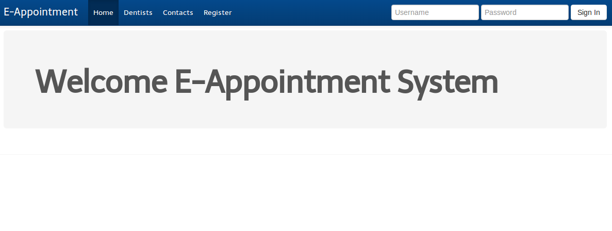
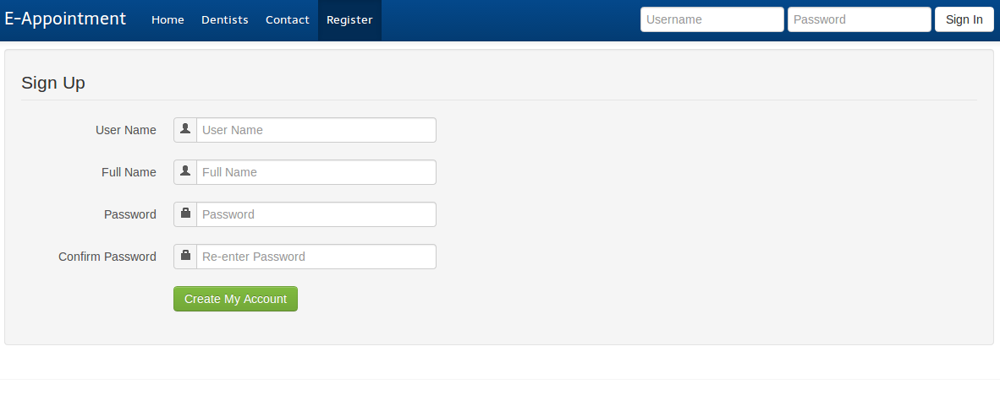
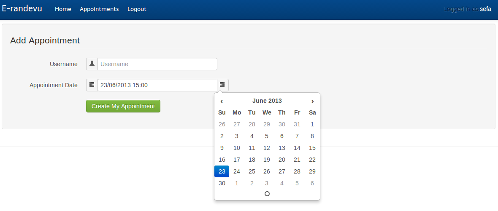
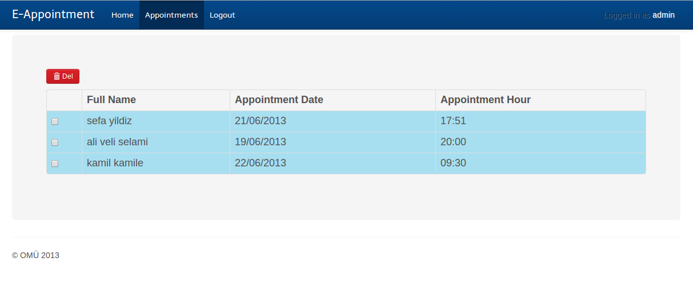

AppoSystem
==========

Simple Appointment System for Dentists

for practice about;

* [CRUD] using [JSP]

* [MVC]

* [BEANS]

Source
---

`src/db` - database access object classes

`src/servlets` - controllers

`src/util` - utility class

Screenshots
---

[CRUD]: http://danielniko.wordpress.com/2012/04/17/simple-crud-using-jsp-servlet-and-mysql/

[MVC]: http://www.jansipke.nl/model-view-controller-mvc-with-jsp-and-jstl/

[JSP]: http://www.jsptut.com/

[BEANS]: https://en.wikipedia.org/wiki/JavaBeans
